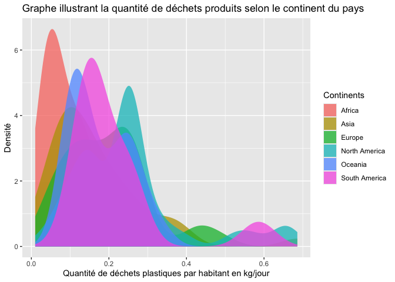

Lab 02 - Plastic waste
================
Lara Prodanovic
18/09/2025

## Questions Warm up

Quelles sont les quatre zones présentes sur RStudio ?

- Les quatre zones qui constituent la fenêtre RStudion sont les
  suivantes : une zone ‘source’ où l’on peut retrouver le code sur
  lequel on travaille, une zone ‘environnement’ où l’on retrouve
  notamment les options pour le Git, une zone ‘console’ avec la console
  et le terminal et une dernière zone où l’on retrouve les différents
  fichiers en rapport avec notre projet ainsi que d’autres
  fonctionnalités.

Combien y a-t-il d’observations dans le jeu de données ?

- En regardant la zone ‘environnement’ on peut voir qu’il y a 240
  observations dans le jeu de données

En regardant les données, vous voyez que certaines cellules ont comme
valeurs NA. Que cela signifie-t-il ?

- NA signifie ‘Non Available’ donc que l’information nécessaire
  n’apparaît pas dans le jeu de données.

## Chargement des packages et des données

``` r
library(tidyverse) 
```

``` r
plastic_waste <- read_csv("data/plastic-waste.csv")
```

Commençons par filtrer les données pour retirer le point représenté par
Trinité et Tobago (TTO) qui est un outlier.

``` r
plastic_waste <- plastic_waste %>%
  filter(plastic_waste_per_cap < 3.5)
```

## Exercices

### Exercise 1

``` r
ggplot(plastic_waste, aes(x = plastic_waste_per_cap)) +
  geom_histogram(binwidth = 0.4) +
  facet_grid(~continent) +
  labs (title = "Distribution des quantité de déchets par habitant sur divers continents", x = "quantité de déchets plastiques par habitant en kg/jour")
```

<!-- -->

Que pouvez-vous dire de la comparaison des continents, en terme de
déchets plastiques ?

- L’Europe et l’Amérique du Nord semblent être les continents qui
  polluent le plus en grande quantité. L’Océanie et l’Amérique du Sud
  polluent peu alors que les habitants d’Asie et d’Afrique sont très
  nombreux à polluer très peu,

### Exercise 2

``` r
ggplot(plastic_waste, aes(x = plastic_waste_per_cap, fill = continent)) +
  geom_density(alpha = 0.75, colour = NA)
```

<!-- -->

Décrivez pourquoi le reglage de la couleur (color et fill) et le réglage
de la transparence (alpha) ne se trouvent pas au même endroit ? L’un
étant réglé dans aes et l’autre dans geom_density()

- Cela peut s’expliquer par le fait que les fonctions geom\_ servent à
  fixer des paramètres constants alors que aes dépend de la variable. On
  attribue une couleur (remplie) différente à chaque continent alors que
  le paramètre alpha est identique peu importe le continent.

### Exercise 3

Boxplot:

``` r
ggplot(plastic_waste, aes(x = continent, y = plastic_waste_per_cap)) +
  geom_boxplot()
```

<!-- -->

Violin plot:

``` r
ggplot(plastic_waste, aes(x = continent, y = plastic_waste_per_cap)) +
  geom_violin()
```

<!-- -->

Qu’est ce que les violin plots permettent de voir sur les données que
les boxplot ne permettent pas ?

- Les boxplots sont construits à partir de points statistiques tels que
  la moyenne, les quartiles, etc… Ils ne montrent donc pas la
  répartition complète des données mais offrent plutôt une
  représentation synthétique. A l’inverse, les violins permettent
  d’illustrer la distribution des données de manière beaucoup plus
  complète.

### Exercise 4

``` r
# insert code here
```

Réponse à la question…

### Exercise 5

``` r
# insert code here
```

``` r
# insert code here
```

Réponse à la question…

## Conclusion

Recréez la visualisation:

``` r
# insert code here
```
